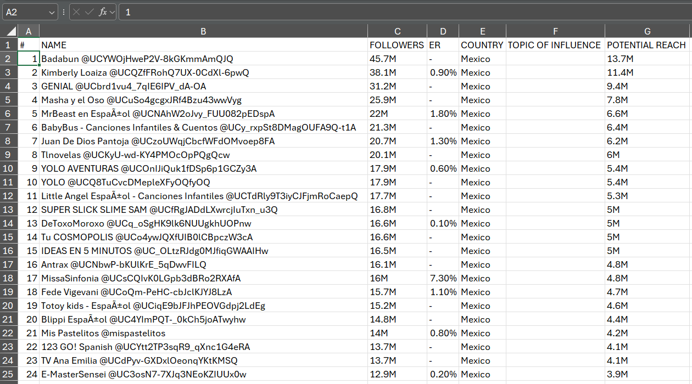
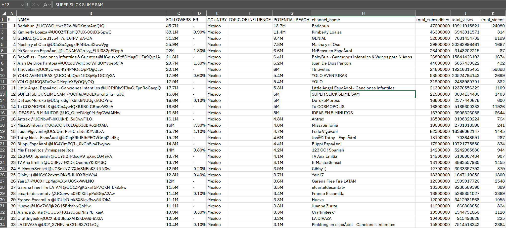
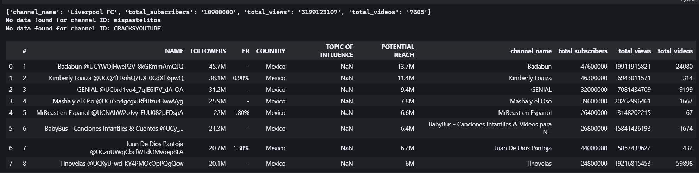
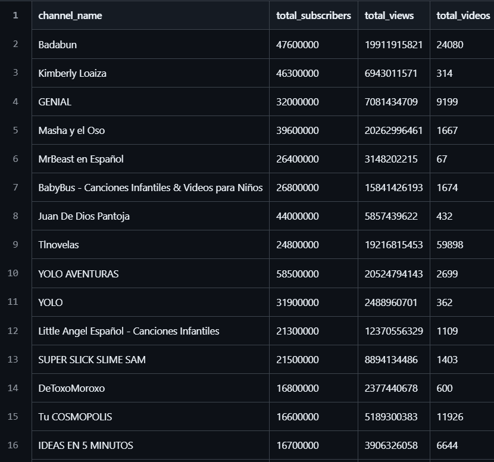
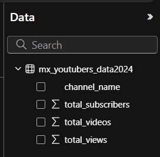

# Top 100 YouTubers from Mexico
**A data portfolio project using Excel, PostgreSQL, and Power BI to analyse the top 100 YouTubers from Mexico**


Image from [storyset](https://storyset.com/search?q=video%20influencer)

> **Note**
>
> This project was inspired and guided by the work of Stephen David William on [GitHub](https://github.com/sdw-online), wwhose data portfolio project provided invaluable insights and direction. I deeply appreciate the effort and dedication Stephen put into creating such a comprehensive resource.
>
> Original Project:
> 
> Title: Excel to Power BI Portfolio Project | Full End-to-End Data Project | top_uk_youtubers_2024. Author: Stephen David William. Platform: [YouTube](https://www.youtube.com/watch?v=mm_sN-Elplg&t=510s&ab_channel=Stephen%7CData)
>
> I have used this project as a foundation to expand my skills and knowledge in data analytics. All credit for the original concept and methodology goes to[Stephen David William](https://www.linkedin.com/in/stephen-david-williams-860428123/).
<br/>

## Table Of Contents
- [Executive Summary](#executive-summary)
  - [Primary Goal](#primary-goal)
  - [Solution](#solution)
  - [Key Findings](#key-findings)
  - [Recommendations](#recommendations)
- [Introduction](#introduction)
  - [Business Problem](#business-problem)
  - [Goals](#goals)
 - [Methodology](#methodology)
   - [Data Source](#data-source)
   - [Tools](#tools)
   - [Data Cleaning](#data-cleaning)
   - [Extracting data from YouTube](extracting-data-from-youtube)
   - [Data Transformation in SQL](#data-transformation-in-sql)
   - [Analysis in Power BI](#analysis-in-power-bi)
     - [DAX measures](#dax-measures)
     - [Data Visualisation](#data-visualisation)
- [Results and Implications](#results-and-implications)

---
## Executive Summary
### Primary Goal
Identify the top YouTubers from Mexico in 2024 to determine which influencers are best suited for running successful marketing campaigns throughout the rest of the year.

### Solution
Develop a dashboard to provide insights into the top Mexican YouTubers in 2024, showcasing their **subscriber count, total views, total videos**, and **engagement metrics**. This tool will support the marketing team in making informed decisions about which YouTubers to collaborate with for their campaigns.


### Key Findings
-
- a
-

### Recommendations
-
-
-

---

## Introduction

### Business Problem
The marketing team needs to identify and collaborate with the most influential Mexican YouTubers to maximise the effectiveness of their marketing campaigns. Currently, they lack a comprehensive and easily accessible tool that provides insights into key metrics such as subscriber count, total views, total videos, and engagement metrics. This gap hinders their ability to make informed decisions about which YouTubers to partner with for optimal campaign performance.

### Goals
1. Develop an Interactive Dashboard: Create a user-friendly dashboard using Power BI to visualise data on the top Mexican YouTubers in 2024.
2. Data Collection and Integration: Gather comprehensive data on subscriber counts, total views, total videos, and engagement metrics for the top YouTubers in Mexico.
3. Insight Generation: Analyse the collected data to identify trends and patterns among the top YouTubers.
4. Support Informed Decision-Making: Equip the marketing team with actionable insights to identify the best YouTubers for collaboration.
5. Customisable Features: Allow for customisable views and filters within the dashboard to cater to the specific needs and preferences of the marketing team.

---
## Methodology

### Data source

The dataset is sourced from [Kaggle](https://www.kaggle.com/datasets/bhavyadhingra00020/top-100-social-media-influencers-2024-countrywise?resource=download). To view the CSV file, click [here](assets/data/youtube_data_mexico.csv).

his dataset provides structured information about the top 100 YouTubers from Mexico in 2024. Each entry represents a YouTuber and includes the following attributes:

| Column name | Description | 
| :--- | :--- |
| `#` | The ranking of the YouTuber in the top 100 list |
| `NAME` | The name or pseudonym of the YouTuber |
| `FOLLOWERS` | The total number of subscribers the influencer has on YouTube |
| `ER` | Engagement Rate: The level of interaction that the influencer's content receives from users on social media platforms, expressed as a percentage |
| `COUNTRY` | The geographical location or country where the YouTuber is based or primarily operates |
| `TOPIC OF INFLUENCE` | The niche or category in which the YouTuber specialises or creates content, such as fashion, beauty, technology, fitness, etc. |
| `POTENTIAL REACH` | TThe estimated number of people who could see a YouTube video or campaign from this influencer |

### Tools
- Excel: To explore the data
- PostgreSQL: To clean, test, and analyse the data
- Power BI: To visualise the data via interactive dashboards
- GitHub: To host the project documentation and version control

### Data Cleaning
Displayed below is a screenshot of a portion of the data presented in Excel.



The objective is to refine our dataset, ensuring it is well-structured and primed for analysis.

Criteria for the cleaned data:
- Retain only the columns that are pertinent.
- Ensure all data types are suitable for their respective columns.
- Verify that no column contains null values, guaranteeing completeness of all records.

After the initial data exploration, I realised that some columns, such as `ER`, `COUNTRY`, and `TOPIC OF INFLUENCE`, are either irrelevant for our analysis or have missing values. Considering our primary goal and the desired solution, the dataset should contain information related to subscriber count, total views, total videos, and engagement metrics. Therefore, I needed to extract this information from YouTube to complement our dataset. I used a Python script to extract that information from YouTube.

### Extracting data from YouTube
I implemented a Python script based on the script developed by Stephen David William, available on [GitHub]([https://github.com/sdw-online](https://github.com/sdw-online/top_uk_youtubers_2024). To see the script I used, just click [here](assets/script/script_youtube_python.py). 

After running the script, the dataset included four additional columns: `channel_name`,	`total_subscribers`,	`total_views` and `total_videos`as seen in the following image. However, the script did not extract data from two YouTubers, possibly due to unrecognised channel IDs.



The script output found no data on these two channels, even though they actually exist on YouTube. Therefore, I decided to manually enter this data using the information from the 'About' section of these YouTube channels. I added this information at the end of the table, so I could use Excel or SQL to sort the channels by their respective ranks based on	`total_subscribers`,	`total_views` and `total_videos` later on. 



For the following steps, I used PostgreSQL. I changed the column names to lowercase with dashes instead of spaces and renamed the column `rank` instead of `#`in Excel before loading the data into SQL. The updated dataset can be found [here](assets/data/updated_youtube_data_mex.csv) and the following image shows a view of this dataset 


### Data Transformation in SQL
I developed a SQL script for data cleaning. For a detailed review of the script, click [here](assets/scripts/sql-script-youtubers-mx.sql). The steps involved in the scripts were:
1. Create the database.
2. Create the table to store YouTube data.
3. Import the data into the newly created table and verify proper loading.
4. Create a view to simplify the data by selecting specific columns: `channel_name`,	`total_subscribers`,	`total_views` and `total_videos`.
5. Perform data quality checks:
   - a. Verify the number of rows: Top 100 YouTube channels.
   - b. Verify the number of columns: `channel_name`,	`total_subscribers`,	`total_views` and `total_videos`
   - c. Check the data type of each variable.
   - d. Check the number of unique channels in the database or count the number of duplicate channels.
6. Create a new table to export the data to a CSV file. To see the output file, click this [link](assets/data/mx_youtubers_data2024.csv).




### Analysis in Power BI
I loaded the CSV file [mx_youtubers_data2024](assets/data/mx_youtubers_data2024.csv) into a Power BI report, and the following image showed that the variables were correctly loaded.



#### DAX measures
I constructed a table with all the essential measures for the analysis, employing DAX formulas to develop these metrics.

**1. `AvgViewsPerVideo(M)`** <br />
Computes the average number of views per video, expressed in millions, for a YouTube channel
```sql  
AvgViewsPerVideo(M) =
  VAR sumtotalviews = SUM(mx_youtubers_data2024[total_views])
  VAR sumofvideos = SUM(mx_youtubers_data2024[total_videos])
  VAR avgviewspervideo = DIVIDE(sumtotalviews, sumofvideos, BLANK())
  VAR avgviewspervideomillions = DIVIDE(avgviewspervideo, 1000000, BLANK())

RETURN avgviewspervideomillions
```
<br />

**2. SubscriberEngagementRate** <br />
Calculates the average number of subscribers per video for a YouTube channel 
```sql  
SubscriberEngagementRate =
  VAR sumtotalsubscribers = SUM(mx_youtubers_data2024[total_subscribers])
  VAR sumtotalvideos = SUM(mx_youtubers_data2024[total_videos])
  VAR subscribersengrate = DIVIDE(sumtotalsubscribers, sumtotalvideos, BLANK())

RETURN subscribersengrate
```
<br />

**`TotalSubscribers(M)`** <br />
```sql  

```
<br />

```sql  

```
<br />

```sql  

```
<br />

```sql  

```


| `` | Converts the total number of subscribers into millions, making it easier to interpret large subscriber counts | `TotalSubscribers(M) = VAR million = 1000000 VAR sumofsubscribers = SUM(mx_youtubers_data2024[total_subscribers]) VAR totalsubscribers = DIVIDE(sumofsubscribers, million) RETURN totalsubscribers` |
| `TotalVideos` | Sums up the total number of videos for a YouTube channel | `TotalVideos = VAR totalvideos = SUM(mx_youtubers_data2024[total_videos]) RETURN totalvideos` |
| `TotalViews(B)` | Converts the total number of views into billions, providing a clearer representation of large view counts | `TotalViews(B) = VAR billion = 1000000000 VAR sumoftotalviews = SUM(mx_youtubers_data2024[total_views]) VAR totalviews = DIVIDE(sumoftotalviews, billion, BLANK()) RETURN totalviews` |
| `ViewsPerSubscriber` | Determines the total number of views each subscriber has generated, offering insights into how engaged the subscriber base is with the channel's content. | `ViewsPerSubscriber = VAR sumtotalsubscribers = SUM(mx_youtubers_data2024[total_subscribers]) VAR sumofviews = SUM(mx_youtubers_data2024[total_views]) VAR viewspersubscriber = DIVIDE(sumofviews, sumtotalsubscribers, BLANK()) RETURN viewspersubscriber` |


#


